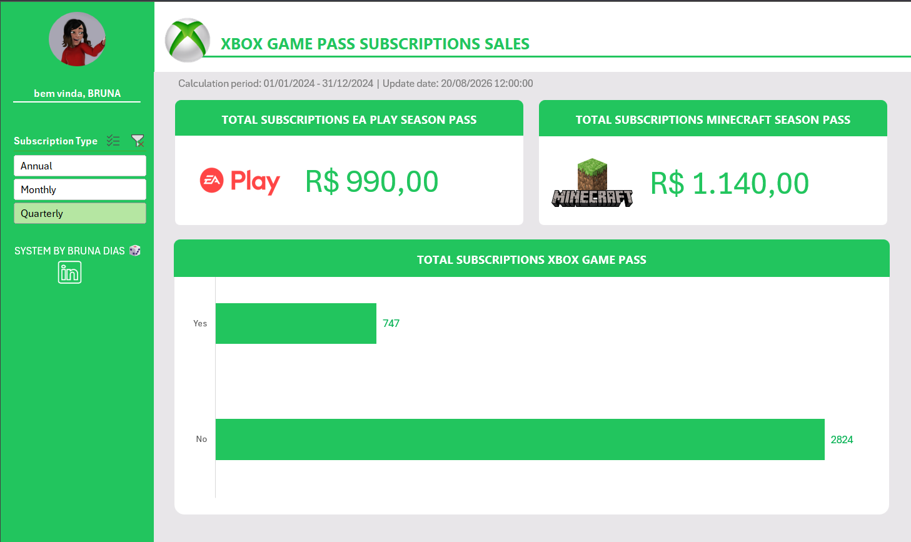

# 🎮 Dashboard de Vendas Xbox — Excel

## 📊 Sobre o projeto

Este projeto apresenta um **Dashboard de Vendas do Xbox desenvolvido no Microsoft Excel**, criado com o objetivo de transformar dados de vendas em informações visuais e facilitar a análise dos resultados.

O dashboard reúne **indicadores, gráficos e filtros interativos**, permitindo uma visão mais clara e objetiva do desempenho das vendas.

---

## 🎯 Objetivos

- 📈 Analisar o desempenho das vendas;
- 💰 Acompanhar o faturamento;
- 🎮 Identificar os produtos com melhor desempenho;
- 🔎 Facilitar a interpretação dos dados;
- 📊 Apoiar a tomada de decisões baseada em dados.

---

## 🛠️ Tecnologias e recursos utilizados

- **Microsoft Excel**
- Tabelas Dinâmicas
- Gráficos Dinâmicos
- Segmentação de Dados
- Tratamento e organização de dados
- Visualização e análise de dados

---

## 🖥️ Dashboard

O dashboard foi desenvolvido com foco em **visualização de dados, organização e facilidade de interpretação**.

Por meio dos gráficos, indicadores e filtros interativos, é possível explorar diferentes perspectivas dos dados de vendas e identificar informações relevantes para a análise dos resultados.

### 📸 Preview

